Calculating the Mean Squared Displacement (MSD) is essential for understanding the dynamics of particles, molecules, and bodies across scientific fields like physics, chemistry, and biology. MSD analysis helps in quantifying how far particles move over time, distinguishing between different types of motion, and identifying diffusion characteristics. However, for large datasets or long time trajectories, the traditional MSD calculation approach can be computationally intense, making the analysis slow and inefficient. This post explores faster approaches to MSD computation, specifically using methods like the Fast Fourier Transform (FFT) and Fast Correlation Algorithm (FCA), which reduce the time complexity from N squared to N logN. By optimizing MSD calculations, we can handle larger datasets more effectively, enabling more detailed and efficient studies in particle dynamics.

[### How to speed up MSD calculations]: <> 

Mean Squared Displacement ($$MSD$$) is one of the key characteristics to describe the dynamics of a molecule/particle/body[^1]. In short, we measure squared distances between positions at time points $$t$$ and $$t+dt$$ for all available time intervals ($$\Delta t$$) and then average them. We can represent it as $$MSD(\Delta t) = D* \Delta t^α$$. $$D$$_ — apparent diffusion coefficient, $$α$$ _—_ anomalous diffusion exponent. You can find the formal definition on [Wiki](https://en.wikipedia.org/wiki/Mean_squared_displacement).

Let’s consider two types of motion: straight motion and random walk.
1. Let’s assume that a particle moves straight with a constant speed of $$V=10$$ m/s. For this case, we can measure distance: $$R = 0$$ when $$t=0$$ sec, $$R = 10$$ m at $$t = 1$$ sec, $$R = 20$$ at $$t = 2$$ sec and so on.


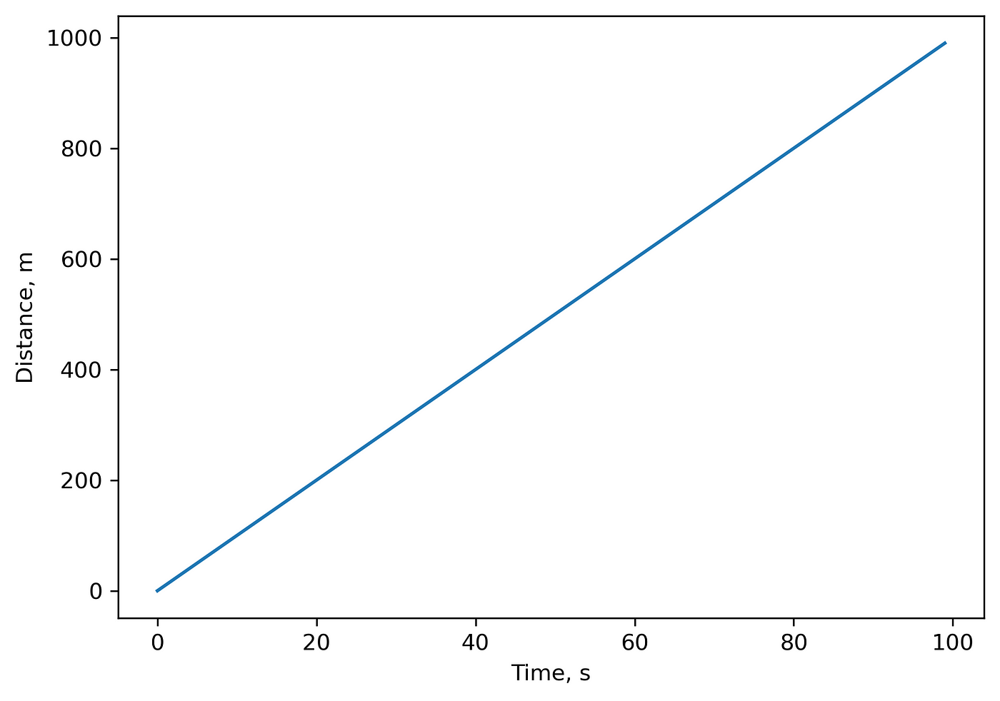


For this motion, $$MSD(\Delta t=1) = 10^2=100\ m^2$$, $$MSD(\Delta t=2) = 400\ m^2$$ and so on:


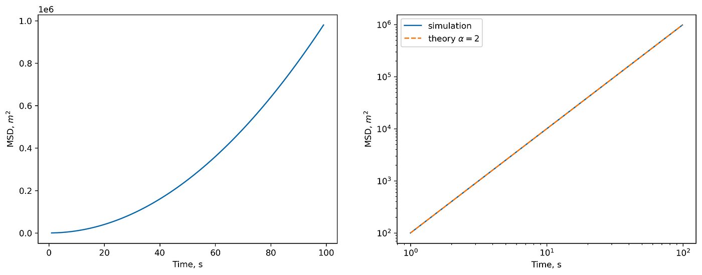

(left) MSD in linear scale. (right) MSD in log-log scale and theoretical prediction.

2. For the random walk (Brownian particle), theory tells us that $$MSD \sim \Delta t^α$$, $$α=1$$. Let’s check it.


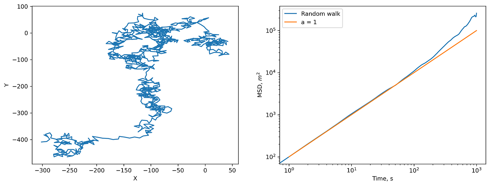

(left) 2D random walk and (right) corresponding MSD.

Everything is correct. Note that deviations from the prediction are due to the small statistics. If you increase the length or number of trajectories, you will get a perfect $$MSD \sim \Delta t$$ _._

To calculate MSD, we use a straightforward method implemented in Python:
```python
def straight_msd(x, y):
    msd = np.zeros((len(x), 2))
    for i in range(len(x)):
        for j in range(i + 1, len(x)):
            msd[j - i, 0] += (x[i] - x[j]) ** 2 + (y[i] - y[j]) ** 2
            msd[j - i, 1] += 1
    return np.divide(
        msd[:, 0], 
        msd[:, 1], 
        out=np.zeros_like(msd[:, 0]), 
        where=msd[:, 1] != 0,
    )
```

The time complexity of this algorithm is $$O(N^2)$$. When you have long trajectories, it becomes a bottleneck. We can make it faster.

Let’s look at the MSD formula closer:


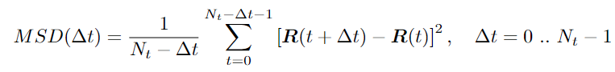

MSD formula

The sum we can split in two:


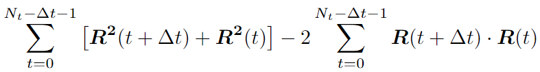


For the first part, we can write the recursive expression:


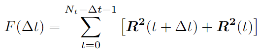


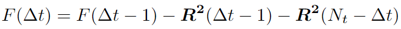


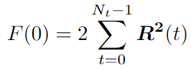


We can use the Fast Correlation Algorithm (FCA) for the second part. We want to get rid of double iteration over $$t$$ and $$t+dt$$. Note this sum is similar to the [autocorrelation function](https://en.wikipedia.org/wiki/Autocorrelation). We can use the Fast Fourier transform (FFT) with a time complexity of $$O(N*logN)$$.


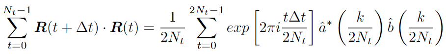

Changing the upper limit is because of the definition of a cyclic correlation. We use zero padding to take it into account.

One can find the FCA implementation details[^2] (paragraph 4.1). We can assemble all in the code, which I found on [StackOverflow](https://stackoverflow.com/a/34222273/3262855) :
```python
def autocorrFFT(x):
    N = len(x)
    F = np.fft.fft(x, n=2*N)  #2*N because of zero-padding
    PSD = F * F.conjugate() # power spectrum density
    res = np.fft.ifft(PSD)
    res = (res[:N]).real #now we have the autocorrelation in convention B
    n = N * np.ones(N) - np.arange(0,N) #divide res(m) by (N-m)
    return res / n #this is the autocorrelation in convention A

def msd_fft(r):
    N = len(r)
    D = np.square(r).sum(axis=1) 
    D = np.append(D, 0) 
    S2 = sum([autocorrFFT(r[:, i]) for i in range(r.shape[1])])
    Q = 2 * D.sum()
    S1 = np.zeros(N)
    for m in range(N):
        Q = Q - D[m - 1] - D[N - m]
        S1[m] = Q / (N - m)
    return S1 - 2 * S2
```

Now, let’s compare the output of `straight_msd` and `msd_fft` functions:


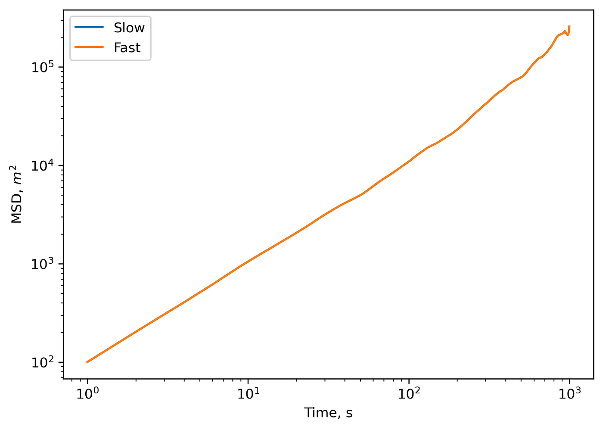

Comparison outputs of ‘slow’ and ‘fast’ MSD calculation methods.

Outputs match perfectly. You might note tiny differences in numbers, which are reasoned by the round-off errors. Finally, let’s check the speed for both algorithms on a 2D trajectory of $$3000$$ timepoints:
```
%timeit straight_msd(x,y)
9.15 s ± 464 ms per loop (mean ± std. dev. of 7 runs, 1 loop each)
```

The more comprehensive benchmark of the “slow” algorithm with $$O(N^2)$$ time complexity and “fast” algorithm with $$O(N*logN)$$ time complexity:


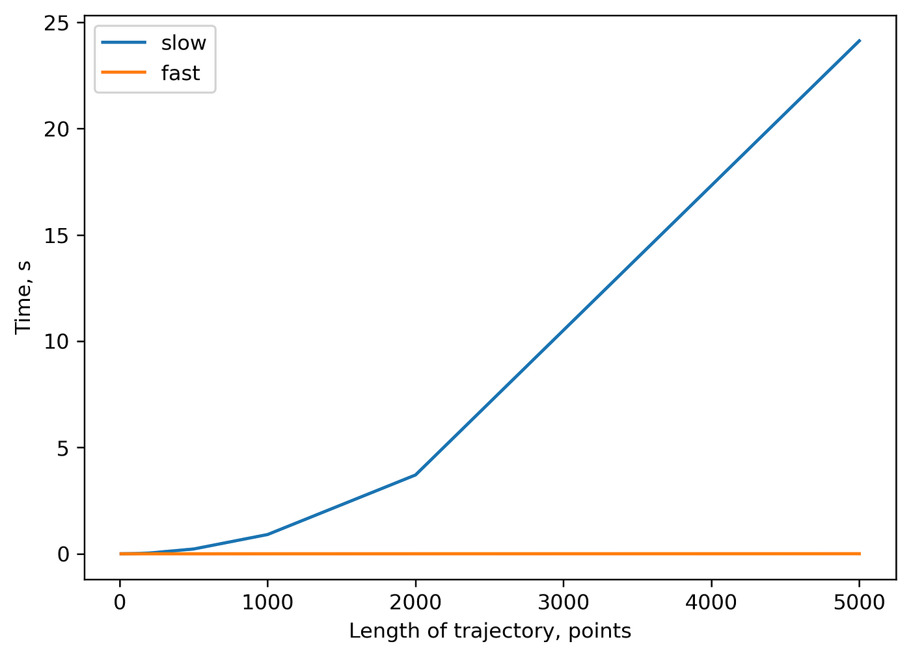


You can check [this repository](https://github.com/polly-code/speed_up_MSD) to reproduce all the plots from above. I am looking forward to any feedback.
### **References**

[^1]: [MDAnalysis 2.0.0, MSD](https://docs.mdanalysis.org/2.0.0/documentation_pages/analysis/msd.html)

[^2]: [Calandrini, V., Pellegrini, E., Calligari, P., Hinsen, K., & Kneller, G. R. (2011). nMoldyn-Interfacing spectroscopic experiments, molecular dynamics simulations and models for time correlation functions. École thématique de la Société Française de la Neutronique, 12, 201-232.](https://www.neutron-sciences.org/articles/sfn/abs/2011/01/sfn201112010/sfn201112010.html)
