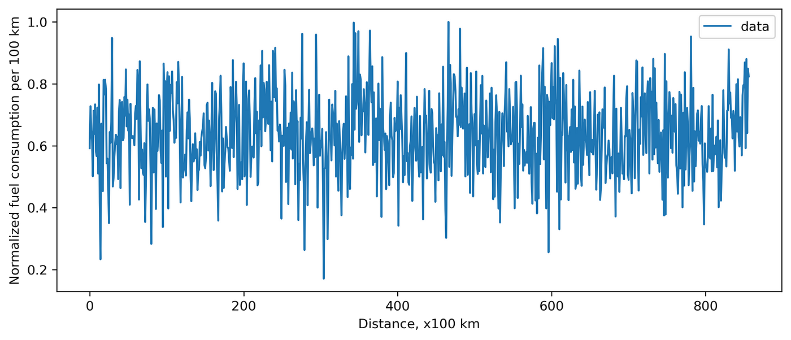
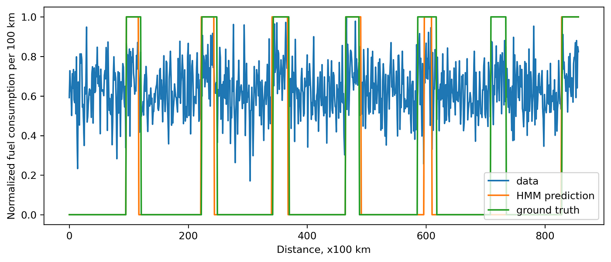

[### How to use Hidden Markov Model (HMM)]: <> 

Calling HMM on your data in python.

Given a dependence $$A(x)$$ , the Hidden Markov Model assigns every point to one of the predefined states.

For instance, car fuel consumption depends on the gas station. Imagine you have data on how much fuel you have spent per every $$100$$ km ($$\sim 62$$ miles). Let’s plot it.





If we know that we use two gas stations. We can create a model with two states. Let’s train and apply it to our data. I use the python package `hmmlearn`. When generating the data, I recorded the ground truth, so now we can compare prediction and the ground truth.





Of course, when the noise is high, it might be hard to distinguish a state precisely.
### What is inside?

I mentioned that the model contains two states. A state corresponds to a normal distribution with a well-defined mean and standard deviation. This is a very strong assumption: the data within each state should be distributed normally. Also, we can go from one state to the other and back. We define the transition matrix: probabilities of staying in state $$1$$, $$2$$ and going $$1 \to 2$$, $$2 \to 1$$. At every step, we calculate what is better: to stay in a current state or go to the other one. We minimize the loss function by repeating this simulation many times.

The idea is similar when we have more states.

Below you can find some python code to reproduce.
```python
import numpy as np
from hmmlearn import hmm

total_s = []
ground_truth = []
for _ in range(7):
    s1_len = int(np.random.normal(100, 5, 1)[0])
    s2_len = int(np.random.normal(30, 5, 1)[0])
    ground_truth += [0]*s1_len + [1]*s2_len
    s1 = list(np.random.normal(10, 2, s1_len))
    s2 = list(np.random.normal(12, 2, s2_len))
    total_s += s1 + s2
    
total_s = np.array(total_s).reshape(-1, 1)
model = hmm.GaussianHMM(
    n_components=2,
    covariance_type="full",
    min_covar=0.1,
    n_iter=10000,
    params="mtc",
    init_params="mtc",
)
model.startprob_ = [0.5, 0.5]
model.fit(total_s)

prediction_hmm = model.predict(total_s)
```

Also, here is a [notebook](https://github.com/polly-code/example_hmm/blob/main/example_call_HMM.ipynb) where you can find how to reproduce plots.
