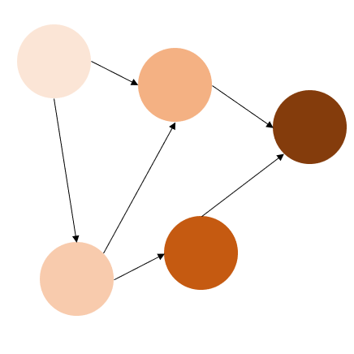

[### A tiny Bayesian network or why probabilities are counterintuitive]: <> 

I want to share an interesting experiment I found in [“The Book of Why” by Judea Pearl and Dana Mackenzie](https://amzn.to/3XreaOD).

The example is elementary: two processes govern the output. You are flying to Zanzibar with the connection in Frankfurt. The connection is short, so there is $$0.5$$ probability that luggage will be transferred at the connection. Second, if the luggage was on a plane it should appear on a carousel within 10 min, so with the probability of $$0.1$$ every minute. If the luggage was on a plane, in $$10$$ minutes, we must see it on a carousel.

Let’s display the dataset:

Table with data

The first row indicates a boundary condition. Additionally, we might want to restructure the data. Instead of probability receiving luggage at minute #$$N$$ we show the probability of receiving the luggage after $$N$$ minutes.

Updated table with the data

The first column is an index, the $$time$$ column indicates elapsed time, the $$arriving\_prob\_if\_was\_transferred$$ column indicates the probability of finding the luggage on a carousel given that the luggage was transferred, and the $$arriving\_prob\_if\_was\_transferred$$ column indicates the probability of finding the luggage on a carousel given that the luggage was **not** transferred, hence contains only zeros.

The question at hand is:

**What is the probability that the luggage was on a plane if, after $$5$$ minutes, we do not observe luggage on a carousel?**
### My first and wrong thought

If the luggage was on a plane, then after $$5$$ min the probability of observing it in the next $$5$$ minutes is $$0.5$$. Conversely, if the luggage was not on a plane, then the probability of observing it on a carousel in the next $$5$$ minutes is $$0$$. I calculate a simple mean, assuming a probability of being transferred is 0.5 and thus we get $$0.25$$.

_This approach is wrong._
### My second and also wrong thought

“If the luggage was transferred — it was transferred, and the probability is $$0.5$$.” This suggest that the probability remains constant $$0.5$$, regardless of the elapsed time. The underlying assumption is that the prior knowledge “ **after $$5$$ minutes we do not observe the luggage on a carousel** ” does not provide an additional assistance in refining this probability.

_This approach is wrong too._
### Book tells us…

Additional knowledge can only improve our understanding of causality in the system. Bayesian rule with conditional probabilities:

$$P(A|B) = P(B|A) * P(A) / P(B)$$

so we can rewrite our question in these terms:

$$P(bag\ on\ a\ plane\ |\ no\ bag\ after\ 5\ min) = \\
P(no\ bag\ after\ 5\ min\ |\ bag\ on\ a\ plane) * \\ 
P(bag\ on\ a\ plane) / P(no\ bag\ after\ 5\ min)$$

where

$$P(no\ bag\ after\ 5\ min\ |\ bag\ on\ a\ plane) = \\
1 — P(arrived\ after\ 5\ min\ |\ transferred) = 0.5$$

$$P(bag\ on\ a\ plane) = 0.5$$ by default

$$P(no\ bag\ after\ 5\ min) = MEAN(1 — P(arrived)) = 0.75$$ when the elapsed time is $$5$$ min, MEAN is calculated over two cases: when the luggage was and was not transferred.

So for the $$t = 5$$ min, we get:

$$P(bag\ on\ a\ plane\ |\ no\ bag\ after\ 5\ min) = 0.5 * 0.5 / 0.75 = 0.33$$

_This approach is correct._
### Where was the mistake?

The error in the first thought lays in neglecting the prior knowledge. In fact, it answers different question: what is the probability of finding the luggage in the last $$5$$ minutes? The answer is $$0.25$$.

The second thought repeats the mistake of neglecting the prior knowledge but makes a wrong assumption about discarding the data. By excluding first $$5$$ minutes from consideration entirely, we reverted to the initial condition. When we initially arrive at a carousel ($$t = 0$$ minutes), the probability that the luggage was on a plane is $$0.5$$, as no additional information was provided.

In reality, the longer we wait, the lower the chances are of finding our luggage on the carousel eventually.
### Another representation

Let’s look at our data table again

Updated table with the data

Waiting for $$5$$ minutes without observing the luggage affect the first $$5$$ minutes if the luggage was transferred. The probability becomes zero and is then redistributed.

Data table after $$5$$ min of not seeing luggage.

After excluding “nan” values representing prior knowledge, there are 5 tiles with non-zero chance to observe the luggage on a carousel, indicating the luggage was transferred, out of a total of $$15$$ tiles. This results in a probability $$5/15 = 1/3$$, as calculated above.
### Same question but we don’t see our luggage for 8 minutes

The idea is the same as for after $$5$$ minutes, see the data

Data table after $$8$$ min of not seeing luggage.

The probability of the luggage was transferred given that after $$8$$ minutes we do not observe it on a carousel is $$2/12 \approx 0.16$$
### Generalization

Let’s explore how the probability of transferring luggage depends on the elapsed time of not seeing the luggage on a carousel for $$N$$ minutes. Here is the plot

One interesting observation is that the probability is non-linear and skewed towards higher chances of eventually receiving the luggage. After $$7$$ minutes, we still have $$23$$% chance of receiving our luggage, which is substantially larger figure than the intuitive incorrect $$15$$% ($$3$$ out of $$20$$).

You can find the code to reproduce all the findings in my [repository](https://github.com/polly-code/bayesian_example).
### Acknowledgements

I want to express my gratitude to my friends Baba for recommending and lending me “The book of why”, Gregory for helping me understand the mistakes in the first two thoughts, to my partner Yulia for contributing to identifying the solution and to you for reading this post. Thank you!

