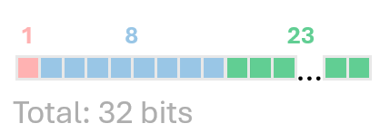
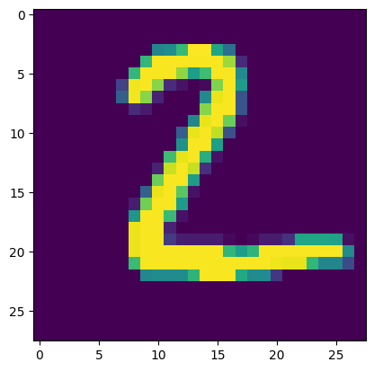

Neural network can take up a lot of space and parameters are usually stored in Floating Point 32 format. For instance, there are Llama 3.1 7B, 40B and 405B models, where B stands for billions. Each FP32 parameter occupyes 32 bits, that is equal to 4 bytes. Thus, the three mentioned versions of LLMs would need 28 GB, 160 GB and 1'620 GB RAM, respectively.

This is a lot of RAM and there are ways how to reduce the size (almost) without affecting the accuracy. But before starting casting models to different formats let's delve into the basics and see what are the formats available in Python. Let's list some of them that we discuss in this post in regard to AI models.

1. Floating point 32
1. Floating point 16
1. Brain floating point 16
1. Floating point 8

### Floating point 32 (FP32)

Let me introduce how Floating point number is organized on the example of FP32. It contains 32 bits, where 1 bit indicates the sign, 8 bits define **Exponent** and 23 bits define **Fraction**.



Every value `V` is defined by the formula:

$$V = (-1)^{sign}*2^{E-127}*(1+\sum_{i=1}^{23}b_{23-i}*2^{-i})$$

For the further reading I refer you to wiki.

It's important to note that FP32 can handle values up to $$10^{38}$$ and precision up to ~$$7.2$$ digits.

### Floating point 16 (FP16)

The next format is FP16, which is a half of FP32. It has 16 bits, where 1 bit indicates the sign, 5 bits define **Exponent** and 10 bits define **Fraction**.


Every value `V` is defined by the formula:

$$V = (-1)^{sign}*2^{E-15}*(1+\sum_{i=1}^{10}b_{10-i}*2^{-i})$$

It's important to note that FP16 can handle values up to $$10^{5}$$ and precision up to ~$$3.3$$ digits.

### Brain floating point 16 (BF16)

BF16 is a special case of FP16, where the exponent is 8 bits and the fraction is 7 bits. This format can handle values up to $$10^{38}$$ same as FP32 but precision only up to ~$$2$$ digits.

The next format is FP8, which is a half of FP16. It has 8 bits, where 1 bit indicates the sign, 4 bits define **Exponent** and 3 bits define **Fraction**.


Every value `V` is defined by the formula:

$$V = (-1)^{sign}*2^{E-7}*(1+\sum_{i=1}^{3}b_{3-i}*2^{-i})$$

### FLoating point 8 (FP8)

The next format is FP8, which is a half of FP16. It has 8 bits, and two versions: E5M2 and E4M3. The latter is subjectively more popular. E5M2 consists of 1 bit indicating the sign, 4 bits for **Exponent** and 2 bits for **Fraction**. E4M3 consists of 1 bit indicating the sign, 3 bits for **Exponent** and 3 bits for **Fraction**.E5M2 can handle values up to $$10^{5}$$ and E4M3 - up to $$10^{3}$$. More information you can find [here](https://arxiv.org/abs/2209.05433).

### Summary on formats


| Format | Bits | Sign | Exponent | Fraction | Max value | Precision |
|--------|------|------|----------|----------|-----------|-----------|
| FP32   | 32   | 1    | 8        | 23       | $$10^{38}$$ | ~7.2      |
| FP16   | 16   | 1    | 5        | 10       | $$10^{5}$$  | ~3.3      |
| BF16   | 16   | 1    | 8        | 7        | $$10^{38}$$ | ~2        |
| FP8 (E5M2)    | 8    | 1    | 4        | 2        | $$10^{5}$$  | ~2        |
| FP8 (E4M3)    | 8    | 1    | 3        | 3        | $$10^{3}$$  | ~2        |


# Example with simple network and number recognition

Let's create a simple network that recognizes numbers from 0 to 9. We will use the MNIST dataset. The network will consist of 2 convolutional layers and 2 fully connected layers. The network will be trained on the MNIST dataset and then we will quantize it to different formats.

```python
import torch
from torchvision import datasets, transforms

class SimpleNN(torch.nn.Module):
    def __init__(self):
        super(SimpleNN, self).__init__()
        self.fc1 = torch.nn.Linear(784, 256)
        self.fc2 = torch.nn.Linear(256, 128)
        self.fc3 = torch.nn.Linear(128, 64)
        self.fc4 = torch.nn.Linear(64, 10)

    def forward(self, x):
        x = x.view(x.shape[0], -1)
        x = torch.nn.functional.relu(self.fc1(x))
        x = torch.nn.functional.relu(self.fc2(x))
        x = torch.nn.functional.relu(self.fc3(x))
        x = torch.nn.functional.log_softmax(self.fc4(x), dim=1)
        return x

transform = transforms.Compose(
    [transforms.ToTensor(), transforms.Normalize((0.1307,), (0.3081,))]
)

# Download and load the training data
trainset = datasets.MNIST("mnist_data", download=True, train=True, transform=transform)
trainloader = torch.utils.data.DataLoader(trainset, batch_size=64, shuffle=True)

# Download and load the test data
testset = datasets.MNIST("mnist_data", download=True, train=False, transform=transform)
testloader = torch.utils.data.DataLoader(testset, batch_size=64, shuffle=False)

model = SimpleNN()

print(
    "Total size of the model: ",
    sum(p.element_size() * p.nelement() for p in model.parameters()) / 1_000_000,
)
```

```bash
Total size of the model:   0.971048 MB
```

Let's check the format:
```python
for name, param in model.named_parameters():
    print(f"{name} is loaded in {param.dtype}")
```
```
fc1.weight is loaded in torch.float32
fc1.bias is loaded in torch.float32
fc2.weight is loaded in torch.float32
fc2.bias is loaded in torch.float32
fc3.weight is loaded in torch.float32
fc3.bias is loaded in torch.float32
fc4.weight is loaded in torch.float32
fc4.bias is loaded in torch.float32
```


In order to cast the model parameters to FP16, we can use the following code:
```python
model_fp16 = model.half()
print(
    "Total size of the model: ",
    sum(p.element_size() * p.nelement() for p in model_fp16.parameters()) / 1_000_000,
)
for name, param in model_fp16.named_parameters():
    print(f"{name} is loaded in {param.dtype}")
```
```
Total size of the model:  0.485524
fc1.weight is loaded in torch.float16
fc1.bias is loaded in torch.float16
...
```

Thus by using FP16 we reduced the size of the model by 50%. The same can be done with BF16 and FP8.

```python
model_bf16 = model.to(torch.bfloat16)
print(
    "Total size of the model: ",
    sum(p.element_size() * p.nelement() for p in model_bf16.parameters()) / 1_000_000,
)
for name, param in model_bf16.named_parameters():
    print(f"{name} is loaded in {param.dtype}")
```
```
Total size of the model:  0.485524 MB
fc1.weight is loaded in torch.bfloat16
fc1.bias is loaded in torch.bfloat16
...
```
For FP8 we have two options: E5M2 and E4M3.
```python
model_fp8_e4m3fn = model.to(dtype=torch.float8_e4m3fn)
```
```python
model_fp8_e5m2 = model.to(dtype=torch.float8_e5m2)
```
The size of the model is the same for both formats:
```
Total size of the model:  0.242762 MB
```

Thus by using FP8 we reduced the size of the model by 75%. But these are floating point formats.

Let's test the difference in accuracies between the original model and the quantized models.

```python
model = SimpleNN()
criterion = torch.nn.CrossEntropyLoss()
optimizer = torch.optim.Adam(model.parameters(), lr=0.01)

def train(model, trainloader, valloader, criterion, optimizer, epochs=5):
    train_losses = []
    val_losses = []
    for e in range(epochs):
        # Training step
        model.train()
        running_loss = 0
        progress_bar = tqdm(trainloader, desc=f"Epoch {e+1}/{epochs}")
        for images, labels in progress_bar:
            optimizer.zero_grad()
            output = model(images)
            loss = criterion(output, labels)
            loss.backward()
            optimizer.step()
            running_loss += loss.item()
            progress_bar.set_postfix(loss=running_loss / len(trainloader))
        train_loss = running_loss / len(trainloader)
        train_losses.append(train_loss)
        print(f"Training loss: {train_loss}")

        # Validation step
        model.eval()
        val_running_loss = 0
        with torch.no_grad():
            for val_images, val_labels in valloader:
                val_output = model(val_images)
                val_loss = criterion(val_output, val_labels)
                val_running_loss += val_loss.item()

        val_loss = val_running_loss / len(valloader)
        val_losses.append(val_loss)
        print(f"Validation loss: {val_loss}")

    return train_losses, val_losses

train_losses, val_losses = train(model, trainloader, testloader, criterion, optimizer)
plt.plot(train_losses, label="Training loss")
plt.plot(val_losses, label="Validation loss")
plt.legend()
plt.show()
```

This code trains the model on the MNIST dataset. Now let's test the accuracy of the model on the test dataset.

```python
def test(model, testloader):
    correct = 0
    total = 0
    with torch.no_grad():
        for images, labels in testloader:
            outputs = model(images)
            _, predicted = torch.max(outputs.data, 1)
            total += labels.size(0)
            correct += (predicted == labels).sum().item()
    print(f"Accuracy of the model on the 10000 test images: {100 * correct / total}%")

test_model(model, testloader)
```
```
Accuracy of the model on the 10000 test images: 94.71%
```
To test the model casted to FP16 we also have to cast the test images to FP16.
```python
testloader_fp16 = [(images.half(), labels) for images, labels in testloader]
model_fp16 = copy.deepcopy(model).half()
test_model(model_fp16, testloader_fp16)
```
```
Accuracy of the model on the 10000 test images: 94.72%
```
Unfortunately I don't have access to H100 or alike to measure accuracy with FP8, but I hope the idea is clear. However, I'd like show also inference on the test image.

```python
def test_inference(data_loader, dict_models, ind):
    dataiter = iter(data_loader)
    images, labels = next(dataiter)
    
    img = images[ind]
    img = img / 2 + 0.5  # unnormalize
    npimg = img.numpy()
    plt.imshow(np.transpose(npimg, (1, 2, 0)))
    plt.show()
    for tag, model in dict_models.items():
        model.eval()

        # Move the model to the appropriate device
        model = model.to(device)
        
        # Move the image to the correct device and precision based on the model
        img_input = images[ind].unsqueeze(0).to(device)  # Add batch dimension

        # Handle different precisions
        if tag == 'BF16':
            img_input = img_input.to(dtype=torch.bfloat16)
        elif tag == 'FP16':
            img_input = img_input.to(dtype=torch.float16)
        else:  # FP32, default
            img_input = img_input.to(dtype=torch.float32)

        # Model inference
        with torch.no_grad():
            output = model(img_input)
        
        # Get the predicted class
        predicted_class = torch.argmax(output, dim=1).item()
        ground_truth = labels[ind].item()
        print(f"Prediction of {tag} model is {predicted_class}, ground truth is {ground_truth}")

test_inference(testloader, {'FP32':model, 'BF16':model_bf16, 'FP16':model_fp16}, 1)
```

```
Prediction of FP32 model is 2, ground truth is 2
Prediction of BF16 model is 2, ground truth is 2
Prediction of FP16 model is 2, ground truth is 2
```

# Conclusion

In this post, we discussed different floating point formats and how to cast a model to a different format. We also showed how to train a simple network on the MNIST dataset and how to quantize it to different formats. Additionally, we demonstrated how to test the accuracy of the model on the test dataset and how to make inferences on a single image.

For the convenience of the reader, the full code can be found in the Google colab notebook [here](https://colab.research.google.com/drive/14GsIGZTO24kI8lfTOQNWCM1W06IrXYuZ?usp=sharing).

I hope you enjoyed this post and learned something new. If you have any questions or suggestions, please leave a comment below. Thank you for reading!
