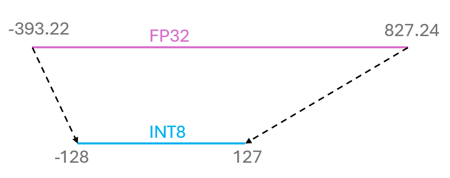

In the previous post we discussed how to quantize a neural network to half precision floating point numbers and even 8 bits. This time we will go even further and quantize the network to integers. This will allow us to reduce the space the network takes up even further. Let's get started with some theory and then we will excercise it on a few examples.

## Theory

Casting FP32 to INT8 can be performed in two ways: symmetric and asymmetric. In the asymmetric case, the range of the floating point numbers is mapped to the range of integers, but the zero point is shifted to the middle of the range. Thus we need scaling factor and offset. First, the offset is calculated as the difference between the middle of the floating point numbers range and the zero point. Then the scaling factor is calculated as the ratio of the range of the floating point numbers to the range of integers. Finally, the floating point numbers are quantized to integers using the following formula:

$$
\text{INT8} = \text{Round}((\text{FP32} - \text{offset}) / \text{scaling factor})
$$
where $$\text{Round}$$ is the rounding function. INT8 is the integer representation of the floating point number FP32. Here is graphical representation of what is happening:




In this example we see that offset is $$221.80$$ and scaling factor is $$4.767$$. Thus for the casting we need two numbers.

In the symmetric case, we do not need offset. The scaling factor can be calculated as the ratio of the ranges FP32 to INT8, or as the maximum absolute value of the floating point numbers to the max of INT8. The formula for the casting is:

$$
\text{INT8} = \text{Round}(\text{max}(\text{abs}(\text{FP32})) / \text{scaling factor})
$$

Here is graphical representation of what is happening:


In this example we see that scaling factor is $$6.463$$. Thus for the casting we need only one number.

## Example with tensor

Let's see how this works in practice. We will create a tensor $$(4,4)$$ with the values in the range $$[-1000, 1000]$$. We will cast it to INT8 and then back using symmetric casting. Let's first define a few functions that will help us with the casting:

```python
import torch
import seaborn as sns
import matplotlib.pyplot as plt
from matplotlib.colors import ListedColormap

def get_q_scale_and_zero_point(tensor, dtype=torch.int8):
    """
    A function that calculates the scale and zero point for quantization.

    Args:
    - tensor: The tensor to quantize
    - dtype: The data type of the quantized tensor
    """
    q_min, q_max = torch.iinfo(dtype).min, torch.iinfo(dtype).max
    r_min, r_max = tensor.min().item(), tensor.max().item()

    scale = (r_max - r_min) / (q_max - q_min)

    zero_point = q_min - (r_min / scale)

    if zero_point < q_min:
        zero_point = q_min
    elif zero_point > q_max:
        zero_point = q_max
    else:
        zero_point = int(round(zero_point))

    return scale, zero_point

def linear_q_with_scale_and_zero_point(tensor, scale, zero_point, dtype=torch.int8):
    """
    A function that quantizes a tensor using a scale and zero point.

    Args:
    - tensor: The tensor to quantize
    - scale: The scale of the quantized tensor
    - zero_point: The zero point of the quantized tensor
    - dtype: The data type of the quantized tensor
    """
    scaled_and_shifted_tensor = tensor / scale + zero_point
    rounded_tensor = torch.round(scaled_and_shifted_tensor)

    q_min = torch.iinfo(dtype).min
    q_max = torch.iinfo(dtype).max

    q_tensor = rounded_tensor.clamp(q_min, q_max).to(dtype)

    return q_tensor

def linear_dequantization(quantized_tensor, scale, zero_point):
    return scale * (quantized_tensor.float() - zero_point)
```

Now we can create the tensor and quantize it:

```python
# Define the range
low = -1000.0
high = 1000.0

# Create a uniform distribution
uniform_dist = torch.distributions.uniform.Uniform(low, high)

# Sample from the distribution
original_tensor = uniform_dist.sample((4, 4))
scaling, offset = get_q_scale_and_zero_point(original_tensor)
quantized_tensor = linear_q_with_scale_and_zero_point(original_tensor, scaling, offset)
dequantized_tensor = linear_dequantization(quantized_tensor, scaling, offset)
plot_quantization_errors(original_tensor, quantized_tensor, dequantized_tensor)
```

Here is the graphical representation of tensors:


For the original and dequantized tensors we can measure the absolute error (difference between the original and dequantized tensor):


The error is quite small, less than $$1%$$. Now we can perform the same operation with the symmetric casting and define a couple of functions to cast the tensor:

```python
def get_q_scale_symmetric(tensor, dtype=torch.int8):
    """
    A function that calculates the scale for symmetric quantization.

    Args:
    - tensor: The tensor to quantize
    - dtype: The data type of the quantized tensor
    """
    r_max = tensor.abs().max().item()
    q_max = torch.iinfo(dtype).max

    # return the scale
    return r_max / q_max


def linear_q_symmetric(tensor, dtype=torch.int8):
    """
    A function that quantizes a tensor using symmetric quantization.

    Args:
    - tensor: The tensor to quantize
    - dtype: The data type of the quantized tensor
    """
    scale = get_q_scale_symmetric(tensor)

    quantized_tensor = linear_q_with_scale_and_zero_point(
        tensor,
        scale=scale,
        # in symmetric quantization zero point is = 0
        zero_point=0,
        dtype=dtype,
    )

    return quantized_tensor, scale
```


For the original and dequantized tensors we can measure the absolute error (difference between the original and dequantized tensor):


To directly compare the two methods, we can calculate the mean squared error:

```python
mse_asym = (dequantized_tensor - original_tensor).square().mean()
mse_sym = (dequantized_tensor_sym - original_tensor).square().mean()

print(f"MSE asymmetric: {mse_asym}")
print(f"MSE symmetric: {mse_sym}")
```

```console
MSE asymmetric: 3.482797622680664
MSE symmetric: 4.056781768798828
```

The asymmetric casting has a lower mean squared error. This is because the symmetric casting does not take into account the offset. But the difference is not that big but we needed only one number for the symmetric casting. This is a trade-off between the two methods.

When higher precision is needed, there are other techniques, such as choosing granularity of the quantization.

## Granularity

As you see, one can use one number to quantize the entire tensor. When the tensor is big and/or has large values, it's unevitable that the precision will drop. Here is the example of how the MSE grows in both cases. Let's explore the dependencies, each point is averaged on 100 tensors.


Now we used one number to cast the entire tensor. To boost the precision, one can use more numbers to cast the tensor. This is called granularity. The tensor is divided into smaller parts and each part is casted separately. This way the precision is higher. For instance we can do it per channel or even per group. Here is the visual representation of these approaches:


The more granular the casting is, the higher the precision. But the more numbers are needed to cast the tensor. This is a trade-off between the precision and the number of numbers needed. Let's compare the MSE for the three cases. Let's define the functions for the per channel and per group casting:

```python
def linear_q_symmetric_per_channel(r_tensor, dim, dtype=torch.int8):
    """
    A function that quantizes a tensor per channel.

    Args:
    - r_tensor: The tensor to quantize
    - dim: The dimension to quantize along
    - dtype: The data type of the quantized tensor
    """
    output_dim = r_tensor.shape[dim]
    # store the scales
    scale = torch.zeros(output_dim)

    for index in range(output_dim):
        sub_tensor = r_tensor.select(dim, index)
        scale[index] = get_q_scale_symmetric(sub_tensor, dtype=dtype)

    # reshape the scale
    scale_shape = [1] * r_tensor.dim()
    scale_shape[dim] = -1
    scale = scale.view(scale_shape)
    quantized_tensor = linear_q_with_scale_and_zero_point(
        r_tensor, scale=scale, zero_point=0, dtype=dtype
    )

    return quantized_tensor, scale


def linear_q_symmetric_per_group(tensor, group_size, dtype=torch.int8):
    """
    A function that quantizes a tensor per group.

    Args:
    - tensor: The tensor to quantize
    - group_size: The size of the group
    - dtype: The data type of the quantized tensor
    """
    t_shape = tensor.shape
    assert t_shape[1] % group_size == 0
    assert tensor.dim() == 2

    tensor = tensor.view(-1, group_size)

    quantized_tensor, scale = linear_q_symmetric_per_channel(tensor, dim=0, dtype=dtype)

    quantized_tensor = quantized_tensor.view(t_shape)

    return quantized_tensor, scale

def linear_dequantization_per_group(quantized_tensor, scale, group_size):
    """
    A function that dequantizes a quantized tensor per group.

    Args:
    - quantized_tensor: The quantized tensor
    - scale: The scale of the quantized tensor
    - group_size: The size of the group
    """
    q_shape = quantized_tensor.shape
    quantized_tensor = quantized_tensor.view(-1, group_size)

    dequantized_tensor = linear_dequantization(quantized_tensor, scale, 0)

    dequantized_tensor = dequantized_tensor.view(q_shape)

    return dequantized_tensor

def quantization_error(original_tensor, dequantized_tensor):
    """
    A function that calculates the quantization error between the original tensor and the dequantized tensor.

    Args:
    - original_tensor: The original tensor
    - dequantized_tensor: The dequantized tensor
    """
    return (original_tensor - dequantized_tensor).square().mean()
```

Now we can cast the tensor per tensor, per channel and per group:

```python
limit = 1000
uniform_dist = torch.distributions.uniform.Uniform(-limit, limit)
original_tensor = uniform_dist.sample((64, 64))

# per tensor
quantized_tensor_per_matrix, scaling_per_matrix = linear_q_symmetric(original_tensor)
dequantized_tensor_per_matrix = linear_dequantization(
    quantized_tensor_per_matrix, scaling_per_matrix, 0
)

# per channel
quantized_tensor_per_channel, scale_per_channel = linear_q_symmetric_per_channel(original_tensor, dim=0)
dequantized_tensor_per_channel = linear_dequantization(quantized_tensor_per_channel, scale_per_channel, 0)

# per group
quantized_tensor_per_group, scaling_per_group = linear_q_symmetric_per_group(
    original_tensor, group_size=8
)
dequantized_tensor_per_group = linear_dequantization_per_group(
    quantized_tensor_per_group, scaling_per_group, group_size=8
)

# print 3 errors
mse_per_matrix = quantization_error(original_tensor, dequantized_tensor_per_matrix)
mse_per_channel = quantization_error(original_tensor, dequantized_tensor_per_channel)
mse_per_group = quantization_error(original_tensor, dequantized_tensor_per_group)

print(f"MSE for per matrix quantization: {mse_per_matrix}")
print(f"MSE for per channel quantization: {mse_per_channel}")
print(f"MSE for per group quantization: {mse_per_group}")
```

And the output is:

```console
MSE for per matrix quantization: 5.178160667419434
MSE for per channel quantization: 4.908818244934082
MSE for per group quantization: 3.649305582046509
```

## Example with a neural network

For the demonstration we will use encoder-decoder transformer `detr-resnet-50` neural network for object detection. We will quantize the network to INT8 using the symmetric casting and compare the result with the original model predictions. As usual let's first define the functions to quantize the network:

```python
def w8_a16_forward(weight, input_data, scales, bias=None):
    """
    A function that performs the forward pass of a linear layer with 8-bit weights and 16-bit scales.

    Args:
    - weight: The quantized weights of the linear layer
    - input: The input tensor
    - scales: The scales of the linear layer
    - bias: The bias of the linear layer
    """
    casted_weights = weight.to(input_data.dtype)
    output = torch.nn.functional.linear(input_data, casted_weights) * scales

    if bias is not None:
        output = output + bias

    return output

class W8A16LinearLayer(torch.nn.Module):
    """
    A class that implements a linear layer with 8-bit weights and 16-bit scales.

    The class initializes the weights and scales randomly and quantizes the weights
    during initialization.

    The forward pass of the layer uses the quantized weights and scales to compute the output.
    """

    def __init__(self, in_features, out_features, bias=True, dtype=torch.float32):
        super().__init__()

        self.register_buffer(
            "int8_weights",
            torch.randint(-128, 127, (out_features, in_features), dtype=torch.int8),
        )

        self.register_buffer("scales", torch.randn((out_features), dtype=dtype))

        if bias:
            self.register_buffer("bias", torch.randn((1, out_features), dtype=dtype))

        else:
            self.bias = None

    def quantize_weights(self, weights):
        w_fp32 = weights.clone().to(torch.float32)
        scales = w_fp32.abs().max(dim=-1).values / 127
        scales = scales.to(weights.dtype)
        int8_weights = torch.round(weights / scales.unsqueeze(1)).to(torch.int8)
        self.int8_weights = int8_weights
        self.scales = scales

    def quantize_activations(self, activations):
        a_fp32 = activations.clone().to(torch.float32)
        scale = a_fp32.abs().max() / 127
        scale = scale.to(activations.dtype)
        int8_activations = torch.round(activations / scale).to(torch.int8)
        self.int8_x = int8_activations
        self.act_scale = scale

    def quantize(self, weights):
        w_fp32 = weights.clone().to(torch.float32)
        scales = w_fp32.abs().max(dim=-1).values / 127
        scales = scales.to(weights.dtype)
        int8_weights = torch.round(weights / scales.unsqueeze(1)).to(torch.int8)
        self.int8_weights = int8_weights
        self.scales = scales

    def forward(self, x):
        return w8_a16_forward(self.int8_weights, x, self.scales, self.bias)

def replace_linear_with_target_and_quantize(
    module, target_class, module_name_to_exclude
):
    """
    A function that replaces all instances of nn.Linear in a module with a target class
    and quantizes the weights.
    
    Args:
    - module: The module to replace the linear layers in
    - target_class: The target class to replace the linear layers with
    - module_name_to_exclude: The names of the modules to exclude from replacement
    """
    for name, child in module.named_children():
        if isinstance(child, torch.nn.Linear) and not any(
            [x == name for x in module_name_to_exclude]
        ):
            old_bias = child.bias
            old_weight = child.weight

            new_module = target_class(
                child.in_features,
                child.out_features,
                old_bias is not None,
                child.weight.dtype,
            )
            setattr(module, name, new_module)

            getattr(module, name).quantize(old_weight)

            if old_bias is not None:
                getattr(module, name).bias = old_bias
        else:
            # Recursively call the function for nested modules
            replace_linear_with_target_and_quantize(
                child, target_class, module_name_to_exclude
            )

# colors for visualization
COLORS = [
    [0.000, 0.447, 0.741],
    [0.850, 0.325, 0.098],
    [0.929, 0.694, 0.125],
    [0.494, 0.184, 0.556],
    [0.466, 0.674, 0.188],
    [0.301, 0.745, 0.933],
]

def plot_results(model, pil_img, results):
    """
    A function that plots the results of object detection on an image.
    
    Args:
    - model: The model used for object detection
    - pil_img: The PIL image to plot
    - results: The results of object detection
    """
    plt.figure(figsize=(16, 10))
    plt.imshow(pil_img)
    ax = plt.gca()
    scores, labels, boxes = results["scores"], results["labels"], results["boxes"]
    colors = COLORS * 100
    for score, label, (xmin, ymin, xmax, ymax), c in zip(
        scores.tolist(), labels.tolist(), boxes.tolist(), colors
    ):
        ax.add_patch(
            plt.Rectangle(
                (xmin, ymin), xmax - xmin, ymax - ymin, fill=False, color=c, linewidth=3
            )
        )
        text = f"{model.config.id2label[label]}: {score:0.2f}"
        ax.text(xmin, ymin, text, fontsize=15, bbox=dict(facecolor="yellow", alpha=0.5))
    plt.axis("off")
    plt.show()

def fetch_image(image_url):
    """
    A function that fetches an image from a URL and returns it as a PIL image.

    Args:
    - image_url: The URL of the image to fetch
    """
    image = Image.open(requests.get(image_url, stream=True).raw).convert("RGB")
    return image
```

Now let's download the model from huggingface. You need to add `HF_TOKEN` when you run the notebook. 
    
```python
model_name = "facebook/detr-resnet-50"
device = torch.device("cpu")
#device = torch.device("cuda" if torch.cuda.is_available() else "cpu")
# you can specify the revision tag if you don't want the timm dependency
processor = DetrImageProcessor.from_pretrained(model_name, revision="no_timm")
model = DetrForObjectDetection.from_pretrained(model_name, revision="no_timm")

original_memory_footprint = model.get_memory_footprint()
print("Footprint of the model in MBs: ", original_memory_footprint / 1e6)
```

```console
Footprint of the model in MBs:  166.524032
```

Now we can download the image:

```python
img_path ="https://cdn.pixabay.com/photo/2020/08/25/18/29/workplace-5517762_1280.jpg"
image = fetch_image(img_path).convert("RGB")
image
```


And perform the object detection:

```python
inputs = processor(images=image, return_tensors="pt")
with torch.no_grad():
    outputs = model(**inputs)

# convert outputs (bounding boxes and class logits) to COCO API
# let's only keep detections with score > 0.9
target_sizes = torch.tensor([image.size[::-1]])
results = processor.post_process_object_detection(
    outputs, target_sizes=target_sizes, threshold=0.95
)[0]
plot_results(model, image, results)
```


Now we can quantize the model and perform the object detection again:

```python
quantized_model = deepcopy(model).to(device).half()
replace_linear_with_target_and_quantize(
    quantized_model,
    W8A16LinearLayer,
    module_name_to_exclude=["0", "1", "2", "class_labels_classifier"],
)

inputs = processor(images=image, return_tensors="pt")
inputs = {
    k: v.to(torch.float16) for k, v in inputs.items()
}  # Convert inputs to half precision

with torch.no_grad():
    outputs = quantized_model(**inputs)

# convert outputs (bounding boxes and class logits) to COCO API
# let's only keep detections with score > 0.9
target_sizes = torch.tensor([image.size[::-1]])
results = processor.post_process_object_detection(
    outputs, target_sizes=target_sizes, threshold=0.95
)[0]

quantized_memory_footprint = quantized_model.get_memory_footprint()
print(
    "Footprint of the quantized int8 model in MBs: ", quantized_memory_footprint / 1e6
)

plot_results(quantized_model, image, results)
```

```console
Footprint of the quantized int8 model in MBs:  66.052672
```


The memory footprint of the quantized model is significantly smaller than the original model:

```python
quantized_memory_footprint / original_memory_footprint
```

```console
0.3966554929441055
```

The quantized model is around 40% of the original model. The object detection results are almost the same. This is a great way to reduce the memory footprint of the model without losing much accuracy.

## Conclusion

In this post we discussed how to quantize a neural network to integers. We discussed the symmetric and asymmetric casting and how to calculate the scaling factor and offset. We also discussed the granularity of the casting and how it affects the precision. We demonstrated the quantization on a tensor and a neural network. The quantized model had a significantly smaller memory footprint than the original model, while the object detection results were almost the same. This is a great way to reduce the memory footprint of the model without losing much accuracy. In the next post we will discuss how to quantize the network to binary numbers.

Important to note that on Hugging Face you can find the quantized models already. You can use them directly without the need to quantize the model yourself. But it's good to know how it works under the hood.

For the convenience of the reader, the full code can be found in the [Google colab notebook](https://colab.research.google.com/drive/1pnkBqw1X0hcpsrj92zQQL16hZU6fs8Bv?usp=sharing).

I hope you enjoyed this post and learned something new. If you have any questions or suggestions, please feel free to reach out to me on [LinkedIn](https://www.linkedin.com/in/pavel-kos/). Thank you for reading!